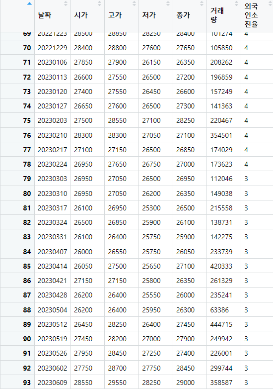

## 금융통계 기말대체 프로젝트

<br/>

***렌터카 관련 기업 비교***

<br/>

렌터카 시장 내 점유율 1,2위에 해당하는 롯데렌탈과 SK렌터카를 비교해보도록 하겠습니다.

<br/>

## 1. 회사 기본 정보

<br/>

'-' **롯데렌탈**

<br/>

-   렌터카 업체에서 점유율 1위를 차지

-   렌탈, 카셰어링 서비스(그린카), 중고차 매매

-   렌탈(70%), 중고차 매매(28%)

-   올 하반기부터 중고차 렌탈 사업 실시

<br/>

'-' **SK렌터카**

<br/>

-   렌터카 업체에서 점유율 2위를 차지

-   중고차렌탈, 중고차 매각, SK렌터카 다고바이(중고차 렌터카 계약 후 소비자가 원하는 시점에 차량 인수할 수 있게 해주는 서비스)

-   렌탈(63%), 중고차 매매(28%)

-   대형/중소 법인 대상으로 업무용 차량 장기렌트해주는 서비스가 주

<br/>

## 2. 각 기업의 차트 데이터 프레임 추출

<br/>

'-' **롯데렌탈**

<br/>

```         
lotte_url <- "https://api.finance.naver.com/siseJson.naver?symbol=089860&requestType=1&startTime=20210903&endTime=20230610&timeframe=week"

lotte_rent <- GET(lotte_url)

lotte_data <- content(lotte_rent, "text", encoding = "UTF-8")

lotte_data <- gsub("'", '"', lotte_data)  

lotte_rent_data <- fromJSON(lotte_data)

lotte_rent_df <- as.data.frame(lotte_rent_data)

colnames(lotte_rent_df) <- lotte_rent_df[1, ]

lotte_rent_df <- lotte_rent_df[-1, ]

rownames(lotte_rent_df) <- NULL

lotte_rent_df
```

<br/>




<br/>

'-' **SK렌터카 데이터**

<br/>

```         
sk_url <- "https://api.finance.naver.com/siseJson.naver?symbol=068400&requestType=1&startTime=20210903&endTime=20230610&timeframe=week"

sk_rent <- GET(sk_url)

sk_data <- content(sk_rent, "text", encoding = "UTF-8")

sk_data <- gsub("'", '"', sk_data)  

sk_rent_data <- fromJSON(sk_data)

sk_rent_df <- as.data.frame(sk_rent_data)

colnames(sk_rent_df) <- sk_rent_df[1, ]

sk_rent_df <- sk_rent_df[-1, ]

rownames(sk_rent_df) <- NULL

sk_rent_df
```

<br/>


<br/>

## 3. 각 기업의 시가, 거래량 그래프

<br/>

'-' **롯데렌탈**

<br/>

```         
par(mfrow=c(1,2))

lotte_rent_date <- as.Date(lotte_rent_df$날짜, format = "%Y%m%d")

plot(lotte_rent_date, lotte_rent_df$시가, type = "l", xlab = "Date", ylab = "시가", main = "롯데렌탈 시가차트")

plot(lotte_rent_date, lotte_rent_df$거래량, type = "l", xlab = "Date", ylab = "거래량", main = "롯데렌탈 거래량")
```

<br/>


<br/>

-   현재 시가가 많이 떨어져 있으며, 거래량도 많이 줄어든 것으로 보아 롯데렌탈 주식에 대한 관심도가 떨어진 것으로 보입니다.

<br/>

'-' **SK렌터카**

<br/>

```         
sk_rent_date <- as.Date(sk_rent_df$날짜, format = "%Y%m%d")

plot(sk_rent_date, sk_rent_df$시가, type = "l", xlab = "Date", ylab = "시가", main = "SK렌터카 시가차트")

plot(sk_rent_date, sk_rent_df$거래량, type = "l", xlab = "Date", ylab = "거래량", main = "SK렌터카 거래량")
```

<br/>


<br/>

-   현재 주가는 전보다 조금 오른 것으로 보이지만 많이 오르지 않았고, 거래량도 같이 보게 될 경우 롯데 렌탈과 비슷한 수준으로 관심도가 떨어진 것으로 보입니다.

<br/>

## 4. 각 기업의 기업 실적 데이터 프레임 추출

<br/>

'-' **롯데렌탈**

<br/>

```         
lotte_url_1 <- "https://finance.naver.com/item/main.naver?code=089860"

lotte_html <- read_html(lotte_url_1, encoding="euc-kr")

lotte_table <- lotte_html %>%
  html_table() %>% 
  .[[4]] %>% 
  as.data.frame()
```

<br/>


<br/>

'-' **SK렌터카**

<br/>

```         
sk_url_1 <- "https://finance.naver.com/item/main.naver?code=068400"

sk_html <- read_html(sk_url_1, encoding="euc-kr")

sk_table <- sk_html %>%
  html_table() %>% 
  .[[4]] %>% 
  as.data.frame()
```

<br/>


<br/>

## 5. 두 기업의 매출액 그레프

<br/>

-   각 기업의 기업실적 데이터 프레임에서 매출액 부분 추출해 두 기업의 매출액 그래프 그리기

<br/>

```         
lotte_sale <- lotte_table[3, 2:5] 

sk_sale <- sk_table[3, 2:5]

sale <- rbind(lotte_sale,sk_sale)

colnames(sale) <- c("2020", "2021", "2022", "2023")

rownames(sale) <- c("lotte", "sk")

sale_x <- c("2020", "2021", "2022", "2023")

sale_y1 <- as.numeric(gsub(",", "", sale[1, sale_x]))

sale_y2 <- as.numeric(gsub(",", "", sale[2, sale_x]))

plot(as.numeric(sale_x), sale_y1, type = "p", pch = 1, col = "blue", ylim = c(8000, 30000),xlab = "년도", ylab = "값", main = "롯데렌탈, SK렌터카 매출액")

points(as.numeric(sale_x), sale_y2, pch = 2, col = "red")

legend("topleft", legend = c("lotte", "sk"), pch = c(1, 2), col = c("blue", "red"))
```

<br/>


<br/>

-   두 기업 모두 매출액이 증가하는 추세

<br/>

## 6. 두 기업의 부채비율 그래프

<br/>

-   각 기업의 기업실적 데이터 프레임에서 부채비율 부분 추출해 두 기업의 부채비율 그래프 그리기

<br/>

```         
lotte_debt <- lotte_table[9, 2:4]  

sk_debt <- sk_table[9, 2:4]

debt <- rbind(lotte_debt,sk_debt)

colnames(debt) <- c("2020", "2021", "2022")

rownames(debt) <- c("lotte", "sk")

debt_x <- c("2020", "2021", "2022")

debt_y1 <- as.numeric(gsub(",", "", debt[1, debt_x]))

debt_y2 <- as.numeric(gsub(",", "", debt[2, debt_x]))

plot(as.numeric(debt_x), debt_y1, type = "p", pch = 1, col = "blue", ylim = c(350, 700),xlab = "년도", ylab = "값", main = "롯데렌탈, SK렌터카 부채비율")

points(as.numeric(debt_x), debt_y2, pch = 2, col = "red")

legend("topright", legend = c("lotte", "sk"), pch = c(1, 2), col = c("blue", "red"))
```

<br/>


<br/>

'-' **롯데렌탈** : 초반인 2020년에 부채비율이 엄청 높은 비율을 차지했으나 그 이후 21년 감소하고 22년 조금 증가하는 형태

<br/>

'-' **SK렌터카** : 부채비율이 초반부터 시간이 갈수록 점점 증가하는 형태

<br/>

-   롯데렌탈의 경우 대규모 초기 투자로 인해 2020년 부채비율이 높았다가 그 다음해인 21년 감소한 것으로 보이고, SK렌터카의 경우 점차 사업을 확장시키며 부채비율이 증가하는 것으로 보입니다.

<br/>

## 7. 동일 업종 시가총액, 매출액 그래프

<br/>

```         
##렌터카 회사 정보 데이터 프레임 추출

total_table <- lotte_html %>%
  html_table() %>% 
  .[[5]] %>% 
  as.data.frame()

##각 기업들의 시가총액 추출

siga <- total_table[4, ]

siga <- siga[,-1]

str(siga)

siga_num <- as.numeric(gsub(",", "", siga))

##각 기업들의 매출액 추출

revenue <- total_table[6, ]

revenue <- revenue[,-1]

str(revenue)

revenue_num <- as.numeric(gsub(",", "", revenue))

##각 기업의 시가총액, 매출액 그래프

plot(siga_num, type = "l", col = "red", lwd = 2, ylim = c(0, max(siga_num)), xlab = "회사", ylab = "값", main = "각 기업의 시가총액, 매출액")

lines(revenue_num, type = "l", col = "blue", lwd = 2)

axis(1, at = 1:5, labels = colnames(siga))
```

<br/>


<br/>

-   AJ네트윅스와 레드캡투어는 시가총액과 매출액이 비례하지 않지만, 나머지 3기업을 보게 될 경우 시가총액이 높은 기업이 매출액도 높은 것으로 보입니다.

<br/>

## 8. 결론

<br/>

'-' 렌터카 산업은 다양한 서비스 제공을 통해 확장될 가능성이 있고 주식에 대한 위험부담감도 적을 것으로 보입니다.

