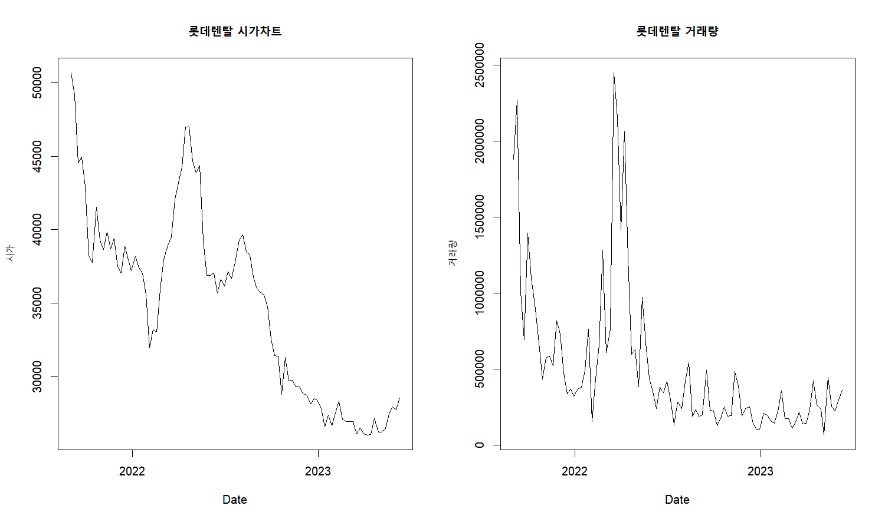

# my_repo2

# title : "렌터카 시장 분석"

library(httr)
library(jsonlite)
library(rvest)
library(tidyverse)

# 롯데렌탈 데이터 

lotte_url <- "https://api.finance.naver.com/siseJson.naver?symbol=089860&requestType=1&startTime=20210903&endTime=20230610&timeframe=week"
lotte_rent <- GET(lotte_url)
lotte_data <- content(lotte_rent, "text", encoding = "UTF-8")
lotte_data <- gsub("'", '"', lotte_data)  
lotte_rent_data <- fromJSON(lotte_data)
lotte_rent_df <- as.data.frame(lotte_rent_data)
colnames(lotte_rent_df) <- lotte_rent_df[1, ]
lotte_rent_df <- lotte_rent_df[-1, ]
rownames(lotte_rent_df) <- NULL
lotte_rent_df

# 롯데렌탈 시가, 거래량 그래프

par(mfrow=c(1,2))
lotte_rent_date <- as.Date(lotte_rent_df$날짜, format = "%Y%m%d")
plot(lotte_rent_date, lotte_rent_df$시가, type = "l", xlab = "Date", ylab = "시가", main = "롯데렌탈 시가차트")
plot(lotte_rent_date, lotte_rent_df$거래량, type = "l", xlab = "Date", ylab = "거래량", main = "롯데렌탈 거래량")
png("롯데렌탈 시가, 거래량.png", width = 800, height = 600, res = 300)
plot(lotte_rent_date, lotte_rent_df$시가, type = "l", xlab = "Date", ylab = "시가", main = "롯데렌탈 시가차트")
plot(lotte_rent_date, lotte_rent_df$거래량, type = "l", xlab = "Date", ylab = "거래량", main = "롯데렌탈 거래량")
dev.off()

plot(lotte_rent_date, lotte_rent_df$시가, type = "l", xlab = "Date", ylab = "시가", main = "롯데렌탈 시가차트")
plot(lotte_rent_date, lotte_rent_df$거래량, type = "l", xlab = "Date", ylab = "거래량", main = "롯데렌탈 거래량")

롯데렌탈 시가, 거래량.png

[linked phrase](https://github.com/jeungyuna/my_repo2/blob/main/%EB%A1%AF%EB%8D%B0%EB%A0%8C%ED%83%88%20%EC%8B%9C%EA%B0%80%2C%20%EA%B1%B0%EB%9E%98%EB%9F%89.png)

# SK렌터카 데이터

sk_url <- "https://api.finance.naver.com/siseJson.naver?symbol=068400&requestType=1&startTime=20210903&endTime=20230610&timeframe=week"
sk_rent <- GET(sk_url)
sk_data <- content(sk_rent, "text", encoding = "UTF-8")
sk_data <- gsub("'", '"', sk_data)  
sk_rent_data <- fromJSON(sk_data)
sk_rent_df <- as.data.frame(sk_rent_data)
colnames(sk_rent_df) <- sk_rent_df[1, ]
sk_rent_df <- sk_rent_df[-1, ]
rownames(sk_rent_df) <- NULL
sk_rent_df

# 롯데렌탈 시가, 거래량 그래프

sk_rent_date <- as.Date(sk_rent_df$날짜, format = "%Y%m%d")
plot(sk_rent_date, sk_rent_df$시가, type = "l", xlab = "Date", ylab = "시가", main = "SK렌터카 시가차트")
plot(sk_rent_date, sk_rent_df$거래량, type = "l", xlab = "Date", ylab = "거래량", main = "SK렌터카 거래량")

# 롯데렌탈 기업실적 데이터

lotte_url_1 <- "https://finance.naver.com/item/main.naver?code=089860"
lotte_html <- read_html(lotte_url_1, encoding="euc-kr")
lotte_table <- lotte_html %>%
  html_table() %>% 
  .[[4]] %>% 
  as.data.frame()
  

# SK렌터카 기업실적 데이터

sk_url_1 <- "https://finance.naver.com/item/main.naver?code=068400"
sk_html <- read_html(sk_url_1, encoding="euc-kr")
sk_table <- sk_html %>%
  html_table() %>% 
  .[[4]] %>% 
  as.data.frame()
  

# 롯데렌탈, SK렌터카 매출액 데이터프레임

lotte_sale <- lotte_table[3, 2:5] 
sk_sale <- sk_table[3, 2:5]
sale <- rbind(lotte_sale,sk_sale)
colnames(sale) <- c("2020", "2021", "2022", "2023")
rownames(sale) <- c("lotte", "sk")

# 롯데렌탈, SK렌터카 매출액 그래프 그리기

par(mfrow=c(1,1))
sale_x <- c("2020", "2021", "2022", "2023")
sale_y1 <- as.numeric(gsub(",", "", sale[1, sale_x]))
sale_y2 <- as.numeric(gsub(",", "", sale[2, sale_x]))
plot(as.numeric(sale_x), sale_y1, type = "p", pch = 1, col = "blue", ylim = c(8000, 30000),xlab = "년도", ylab = "값", main = "롯데렌탈, SK렌터카 매출액")
points(as.numeric(sale_x), sale_y2, pch = 2, col = "red")
legend("topleft", legend = c("lotte", "sk"), pch = c(1, 2), col = c("blue", "red"))

# 롯데렌탈, SK렌터카 부채비율 데이터프레임

lotte_debt <- lotte_table[9, 2:4] 
sk_debt <- sk_table[9, 2:4]
debt <- rbind(lotte_debt,sk_debt)
colnames(debt) <- c("2020", "2021", "2022")
rownames(debt) <- c("lotte", "sk")

# 롯데렌탈, SK렌터카 부채비율 그래프 그리기

debt_x <- c("2020", "2021", "2022")
debt_y1 <- as.numeric(gsub(",", "", debt[1, debt_x]))
debt_y2 <- as.numeric(gsub(",", "", debt[2, debt_x]))
plot(as.numeric(debt_x), debt_y1, type = "p", pch = 1, col = "blue", ylim = c(350, 700),xlab = "년도", ylab = "값", main = "롯데렌탈, SK렌터카 부채비율")
points(as.numeric(debt_x), debt_y2, pch = 2, col = "red")
legend("topright", legend = c("lotte", "sk"), pch = c(1, 2), col = c("blue", "red"))

# 렌터카 회사 정보 데이터 프레임 추출

total_table <- lotte_html %>%
  html_table() %>% 
  .[[5]] %>% 
  as.data.frame()
  

# 각 기업들의 시가총액 추출

siga <- total_table[4, ]
siga <- siga[,-1]
str(siga)
siga_num <- as.numeric(gsub(",", "", siga))

# 각 기업들의 매출액 추출

revenue <- total_table[6, ]
revenue <- revenue[,-1]
str(revenue)
revenue_num <- as.numeric(gsub(",", "", revenue))

# 각 기업의 시가총액, 매출액 그래프

plot(siga_num, type = "l", col = "red", lwd = 2, ylim = c(0, max(siga_num)), xlab = "회사", ylab = "값", main = "각 기업의 시가총액, 매출액")
lines(revenue_num, type = "l", col = "blue", lwd = 2)
axis(1, at = 1:5, labels = colnames(siga))
